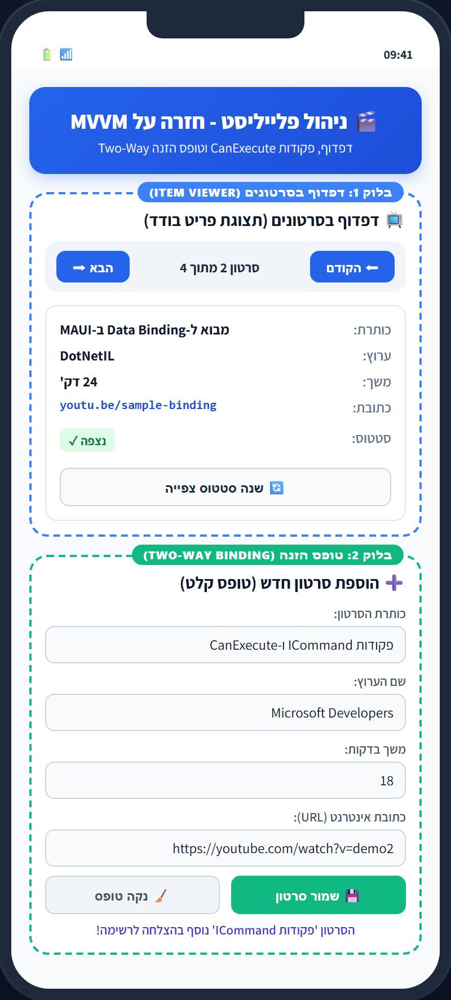
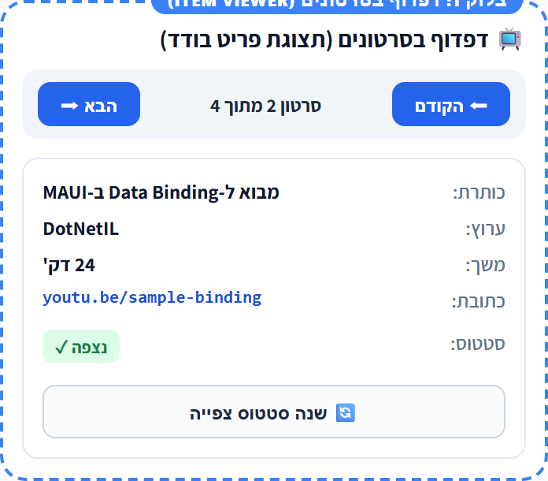
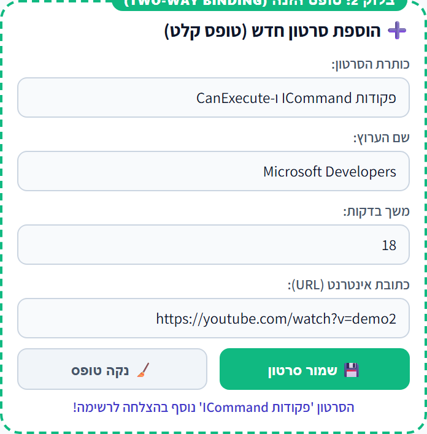

# מדריך פיתוח בשלבים: בניית אפליקציית PlayListSample ב-MVVM למתחילים

> מדריך פדגוגי מודולרי לבניית אפליקציית .NET MAUI שלמה צעד-אחר-צעד, בהשראת מתודולוגיית הבלוקים (The Block Strategy)

---

## 🎯 חלק ראשון: מה מטרת המדריך?

### 1.1 למי נועד המדריך ומה נבנה בו?
ברוכים הבאים לעולם פיתוח האפליקציות ב-.NET MAUI!
אם הגעתם לכאן, כנראה שכבר שמעתם את המושג **MVVM** (Model-View-ViewModel) – דפוס הארכיטקטורה המוביל בתעשייה לפיתוח ממשקי משתמש מודרניים.
עבור מפתחים ותלמידים בתחילת הדרך, המפגש הראשון עם ארכיטקטורת שכבות עלול להיראות מאיים: פתאום לא כותבים קוד בתוך כפתור, יש קבצים שונים, מושגים חדשים כמו `BindingContext`, `INotifyPropertyChanged`, `ICommand` ו-`Service`.

**מטרת מדריך זה היא להוריד את מפלס החרדה ולבנות ביטחון מוחלט בפיתוח.**
במקום להעמיס 300 שורות קוד בבת אחת, נפרק את בניית האפליקציה **PlayListSample** למנות קטנות, הגיוניות וקלות לעיכול:
- נתחיל מהצורך הוויזואלי ומהסקיצה של המסך.
- נבנה תחילה **אך ורק את מנגנון הדפדוף בסרטונים** (החלק העליון של המסך) עם נתונים מקומיים בסיסיים, ללא שירותים מורכבים וללא טופס.
- נפרק הן את ה-ViewModel והן את ה-XAML לבלוקים קטנים וממוקדים, המלווים בטבלאות הסבר מפורטות לכל שדה, פקודה וחיבור.
- נוודא שהכול עובד, מתחבר ומובן.
- רק לאחר מכן נשדרג את המערכת לשכבת שירות מקצועית (`Service`), ולבסוף נוסיף את טופס הזנת סרטון חדש בפירוק מודולרי דומה.

בסיום המדריך תהיה בידיכם אפליקציית פלייליסט סרטונים עובדת, יפהפייה, בנויה לפי הסטנדרטים הגבוהים ביותר של פיתוח מובייל.

---

### 🧠 שאלות הבנה ובדיקה עצמית — חלק ראשון

> [!TIP]
> **נסו להשיב בעצמכם לפני שתמשיכו לשלב הבא:**
> 1. מדוע באפליקציות מובייל מקצועיות מפרידים בין הלוגיקה (ViewModel) לבין עיצוב המסך (View), במקום לכתוב את כל הקוד בקובץ הקוד שמאחורי המסך (Code-Behind)?
>    *(רמז: חשבו מה קורה כשרוצים להחליף עיצוב, או כשרוצים לבדוק את הלוגיקה בלי להפעיל אמולטור).*
> 2. מהו החיסרון המרכזי של כתיבת לוגיקה עסקית באירוע `Button_Clicked` בהשוואה לשימוש בפקודות (`Command`)?

---

## 🧭 חלק שני: מתודולוגיית הפיתוח של המדריך

### 2.1 "שביל הזהב": שרשרת הפיתוח הנכונה
אחת השאלות הנפוצות ביותר אצל מתחילים היא: **"יש לי רעיון למסך — מאיפה מתחילים לכתוב קוד?"**
האם מתחילים ישר בעיצוב ה-XAML? האם קודם כותבים את מחלקות ה-C#?

הניסיון המקצועי מלמד שהדרך הבטוחה והנקייה ביותר להימנע מבאגים ומבלבול היא **מתודולוגיית "שביל הזהב" המודולרית**:

```text
┌─────────────────────────────────────────────────────────────┐
│ 1. שרטוט סקיצה מהירה על דף (Wireframe) ב-2 דקות            │
├─────────────────────────────────────────────────────────────┤
│ 2. הגדרת מודל הנתונים (Model) — מה הישות שלנו?              │
├─────────────────────────────────────────────────────────────┤
│ 3. מחשבת ה-ViewModel — פירוק ל-State, פקודות ורענון         │
├─────────────────────────────────────────────────────────────┤
│ 4. חיבור ה-BindingContext והלבשת המסך ב-XAML (View)        │
├─────────────────────────────────────────────────────────────┤
│ 5. בדיקה ראשונית והרצה של מנגנון הדפדוף                    │
├─────────────────────────────────────────────────────────────┤
│ 6. שדרוג לשכבת שירות (Service & Mockup)                     │
├─────────────────────────────────────────────────────────────┤
│ 7. הרחבת היכולות (טופס הוספה חדש ב-VM וב-View)             │
└─────────────────────────────────────────────────────────────┘
```

### 2.2 עקרונות הפירוק המודולרי לבלוקים (The Modular Block Strategy)
לאורך כל המדריך לא נציג אף קובץ כגוש קוד ארוך, אלא נפעל לפי עקרון הבלוקים:
1. **פירוק ה-ViewModel לבלוקים פונקציונליים:** שדות פרטיים ➔ מאפיינים פומביים ➔ פקודות ➔ פעולה בונה ➔ מתודות ביצוע ו-CanExecute ➔ מתודת עדכון ורענון מרכזי (`RefreshCommands`).
2. **טבלאות ייעודיות לכל שכבה:** טבלת תפקיד שדות המודל, טבלת פקודות ותנאי CanExecute, וטבלת מיפוי בין ה-XAML ל-ViewModel.
3. **פירוק ה-XAML לתת-בלוקים:** הגדרת ראש דף ו-Compiled Bindings ➔ שלד הפריסה ➔ כרטיסיית ה-Border ➔ כותרת ➔ סרגל דפדוף בגריד ➔ קו מפריד ➔ פרטי סרטון ➔ כפתורי פעולה.
4. **שבירת שורות תקנית (Attribute-per-line indent):** בכל תגית המכילה 2 תכונות ומעלה – יורדים שורה עבור כל תכונה כדי למנוע גלישת טקסט ב-PDF ובמסך.

---

### 🧠 שאלות הבנה ובדיקה עצמית — חלק שני

> [!TIP]
> **נסו להשיב בעצמכם לפני שתמשיכו לשלב הבא:**
> 1. כיצד שרטוט מהיר של המסך על דף נייר מסייע לנו לדעת בדיוק אילו מאפיינים (`Properties`) ואילו פקודות (`Commands`) נצטרך לכתוב ב-ViewModel?
> 2. מה עלול לקרות אם נתחיל מיד בעיצוב ה-XAML לפני שהגדרנו את שמות המאפיינים והפקודות ב-ViewModel?

---

## 📱 חלק שלישי: הגדרת האפליקציה ובנייתה בשלבים

### סקיצת המסך (Screen Wireframe) ומפת הבלוקים

לפני שניגש לכתיבת שורת קוד אחת, נבחן את סקיצת המסך של אפליקציית **PlayListSample**.
המסך מחולק לשני בלוקים עיקריים:



#### ניתוח מבנה הסקיצה:
* **בלוק 1 (המסגרת הכחולה העליונה):** כרטיסיית דפדוף וצפייה בסרטון בודד. מכילה סרגל ניווט (`◄ הקודם`, מונה מיקום, `הבא ►`), פרטי הסרטון הנוכחי, וכפתור לשינוי סטטוס צפייה.
* **בלוק 2 (המסגרת הירוקה התחתונה):** כרטיסיית טופס הזנה. מכילה שדות קלט עבור כותרת, ערוץ, משך זמן וכתובת URL, לצד כפתורי שמירה ואיפוס.

> [!IMPORTANT]
> **החלטה פדגוגית מכרעת:** 
> אנו **לא** בונים כרגע את בלוק 2 (הטופס התחתון)!
> כל שלב א' יוקדש כולו, מקצה לקצה, **אך ורק לבלוק 1 (דפדוף בסרטונים)**. נלמד להציג את הסרטון הנוכחי ולדפדף קדימה ואחורה בצורה יציבה ומוגנת.

---

### 🚀 שלב א': מנגנון דפדוף בסרטונים (תצוגה מקומית ללא Service)

---

#### צעד 1: הגדרת מודל הנתונים (`VideoItem.cs`)

מודל (Model) הוא מחלקת C# פשוטה (POCO – Plain Old CLR Object) שתפקידה לייצג את הנתונים העסקיים. המודל אינו מכיר את המסך ואינו יודע כיצד מציגים אותו.

##### 📋 טבלת ניתוח שדות המודל:
לפני שנכתוב את הקוד, נבין מה תפקידו של כל שדה במחלקה:

| שדה / מאפיין | טיפוס (Type) | תפקיד ומשמעות עסקית | דוגמה לערך |
| :--- | :--- | :--- | :--- |
| **`Id`** | `int` | מזהה ייחודי עבור הסרטון (מפתח ראשי עתידי במסד נתונים) | `1`, `2` |
| **`Title`** | `string` | כותרת הסרטון | `"מבוא מעשי ל-NET MAUI"` |
| **`ChannelName`** | `string` | שם הערוץ או היוצר של הסרטון | `"Tech Academy"` |
| **`DurationMinutes`** | `int` | משך הזמן בדקות (ערך מספרי לצורך חישובים) | `12` |
| **`Url`** | `string` | כתובת אינטרנט מלאה לצפייה בסרטון | `"https://youtu.be/maui-intro"` |
| **`IsWatched`** | `bool` | האם הסרטון נצפה כבר על ידי המשתמש (`true`/`false`) | `false` |
| **`FormattedDuration`** | `string` (קריאה בלבד) | מאפיין עזר המעצב את הדקות למחרוזת מוכנה לתצוגה | `"12 דקות"` |
| **`WatchedStatusText`** | `string` (קריאה בלבד) | מאפיין עזר הממיר בוליאני למחרוזת עברית ידידותית | `"נצפה"` / `"טרם נצפה"` |

ניצור בתיקיית `Models` את הקובץ `VideoItem.cs`:

##### בלוק 1.1: מזהה ושדות המידע הבסיסיים
```csharp
namespace PlayListSample.Models;

public class VideoItem
{
    public int Id { get; set; }
    public string Title { get; set; } = string.Empty;
    public string Url { get; set; } = string.Empty;
    public string ChannelName { get; set; } = string.Empty;
    public int DurationMinutes { get; set; }
    public bool IsWatched { get; set; }
```

##### בלוק 1.2: מאפייני עזר לתצוגה נקייה
```csharp
    // מאפייני עזר לקריאה בלבד — מכינים את המידע לתצוגה נקייה ב-UI
    public string FormattedDuration => $"{DurationMinutes} דקות";
    public string WatchedStatusText => IsWatched ? "נצפה" : "טרם נצפה";
}
```

> [!TIP]
> ### ✍️ פינת העמקה: מאפייני עזר במודל במקום ממירי ערכים
> שימו לב לשני המאפיינים `FormattedDuration` ו-`WatchedStatusText`. 
> במקום לכתוב ב-XAML ממיר ערכים מורכב (`ValueConverter`), המודל עצמו מספק את הייצוג הטקסטואלי הנוח להצגה. זוהי דרך פשוטה, קריאה וידידותית ביותר למתחילים!

##### 🧠 שאלות הבנה לשלב 1:
1. מדוע מחלקת המודל אינה מכילה שום פקדי ממשק (כמו `Label` או `Button`)?
2. מה היתרון בהגדרת מאפיין עזר כגון `FormattedDuration` בתוך המודל?

---

#### צעד 2: הגדרת ה-ViewModel בשיטת הבלוקים (שלד ראשוני ללא Service)

ה-ViewModel מתווך בין המודל לבין המסך: הוא מחזיק את הנתונים שהמסך צריך להציג בכל רגע, ומנהל את הפעולות שהמשתמש יכול לבצע.

##### 1. מחלקת הבסיס (`BaseViewModel.cs`)
כדי שהמסך יתעדכן כשאנו משנים ערך ב-C#, המחלקה חייבת לממש את ממשק `INotifyPropertyChanged`.
ניצור בתיקיית `ViewModels` את `BaseViewModel.cs`:

```csharp
using System.ComponentModel;
using System.Runtime.CompilerServices;

namespace PlayListSample.ViewModels;

public abstract class BaseViewModel : INotifyPropertyChanged
{
    public event PropertyChangedEventHandler? PropertyChanged;

    private string _title = string.Empty;
    public string Title
    {
        get => _title;
        set
        {
            if (_title != value)
            {
                _title = value;
                OnPropertyChanged();
            }
        }
    }

    private bool _isLoading;
    public bool IsLoading
    {
        get => _isLoading;
        set
        {
            if (_isLoading != value)
            {
                _isLoading = value;
                OnPropertyChanged();
                OnPropertyChanged(nameof(IsNotLoading));
            }
        }
    }

    public bool IsNotLoading => !IsLoading;

    protected void OnPropertyChanged([CallerMemberName] string? propertyName = null)
    {
        PropertyChanged?.Invoke(this, new PropertyChangedEventArgs(propertyName));
    }
}
```

##### 2. טבלת ניתוח מאפייני המצב (State Properties) של שלב א':
| מאפיין ב-ViewModel | טיפוס | תפקיד בממשק המשתמש (UI) | מתי המאפיין מתעדכן? |
| :--- | :--- | :--- | :--- |
| **`CurrentVideo`** | `VideoItem?` | מחזיק את כל אובייקט הסרטון שמוצג כעת במסך | בעת דפדוף, הוספה או טעינה |
| **`CurrentPositionText`** | `string` | מציג את מונה המיקום הנוכחי (`"סרטון 1 מתוך 3"`) | בכל שינוי אינדקס בסרגל הניווט |
| **`Title`** | `string` | כותרת המסך העליונה | באתחול ה-ViewModel |
| **`IsLoading`** | `bool` | שולט במחוון הטעינה (`ActivityIndicator`) | בפעולות א-סינכרוניות |

##### 3. טבלת ניתוח הפקודות (Commands) של שלב א':
| פקודה (`ICommand`) | פקד מפעיל ב-XAML | פעולת ביצוע (`Execute`) | תנאי ביצוע (`CanExecute`) | מה קורה כשהתנאי שקרי (`false`)? |
| :--- | :--- | :--- | :--- | :--- |
| **`NextCommand`** | כפתור `הבא ➡` | `ExecuteNext()`: קידום האינדקס ב-1 וטעינת הסרטון הבא | `_currentIndex < _videos.Count - 1 && IsNotLoading` | הכפתור הופך לאפור/מנוטרל בסוף הרשימה |
| **`PreviousCommand`** | כפתור `⬅ הקודם` | `ExecutePrevious()`: החזרת האינדקס ב-1 וטעינת הסרטון הקודם | `_currentIndex > 0 && IsNotLoading` | הכפתור הופך לאפור/מנוטרל בסרטון הראשון |
| **`ToggleWatchedCommand`** | כפתור `שנה סטטוס צפייה` | `ExecuteToggleWatched()`: הפיכת ערך `IsWatched` ורענון התצוגה | `CurrentVideo != null && IsNotLoading` | הכפתור מנוטרל אם אין סרטון פעיל |

##### 4. פירוק ה-`MainViewModel` ל-6 בלוקים לוגיים מודולריים

במקום לכתוב את המחלקה ברצף ארוך, נרכיב אותה בלוק אחר בלוק:

###### 🧱 בלוק 1: שדות פרטיים ומשתני מצב (Private Fields & State)
אלו המשתנים הפנימיים שה-ViewModel שומר בזיכרון:
```csharp
using System.Windows.Input;
using PlayListSample.Models;

namespace PlayListSample.ViewModels;

public class MainViewModel : BaseViewModel
{
    // רשימת הסרטונים המקומית (זמנית בבנאי לצורך שלב א')
    private readonly List<VideoItem> _videos;
    private int _currentIndex = 0;

    // שדות המצב של התצוגה
    private VideoItem? _currentVideo;
    private string _currentPositionText = "טוען נתונים...";
```

###### 🧱 בלוק 2: מאפיינים פומביים לתצוגה (Public Properties)
מאפיינים אלו נחשפים ל-XAML. שימו לב שהם כוללים setter המפעיל את `OnPropertyChanged()`:
```csharp
    public VideoItem? CurrentVideo
    {
        get => _currentVideo;
        private set
        {
            if (_currentVideo != value)
            {
                _currentVideo = value;
                OnPropertyChanged();
            }
        }
    }

    public string CurrentPositionText
    {
        get => _currentPositionText;
        private set
        {
            if (_currentPositionText != value)
            {
                _currentPositionText = value;
                OnPropertyChanged();
            }
        }
    }
```

> [!TIP]
> ### ✍️ פינת העמקה: למה בחלק הראשון יש `CurrentVideo` ובחלק השני שדות נפרדים?
> בחלק הדפדוף (בלוק 1), אנו מציגים ישות קיימת מתוך הרשימה. לכן, טבעי ונקי להחזיק אובייקט שלם מסוג `CurrentVideo`, ומתוכו ה-XAML שולף `{Binding CurrentVideo.Title}` וכו'.
> לעומת זאת, בטופס ההוספה (בלוק 2 שנבנה בשלב ג'), המשתמש מקליד נתונים חדשים שטרם נוצר עבורם אובייקט! שם נדרשים שדות קלט בדידים (`InputTitle`, `InputChannelName`) שיתחברו בקישור דו-כיווני (`Two-Way`).

###### 🧱 בלוק 3: הצהרה על הפקודות (Commands Declaration)
אנו מגדירים פקודות מסוג `ICommand` שאליהן יתחברו הכפתורים במסך:
```csharp
    // פקודות ניווט וסטטוס
    public ICommand NextCommand { get; }
    public ICommand PreviousCommand { get; }
    public ICommand ToggleWatchedCommand { get; }
```

###### 🧱 בלוק 4: הפעולה הבונה (Constructor)
כאן מאתחלים את הנתונים המקומיים, מקשרים את הפקודות למתודות הביצוע ולתנאי `CanExecute`, ומעדכנים את התצוגה הראשונית:
```csharp
    public MainViewModel()
    {
        Title = "פלייליסט סרטונים - חזרה על MVVM";

        // 1. אתחול נתונים מקומיים ישירות בבנאי
        _videos = new List<VideoItem>
        {
            new VideoItem
            {
                Id = 1,
                Title = "מבוא מעשי ל-NET MAUI.",
                ChannelName = "Tech Academy",
                DurationMinutes = 12,
                Url = "https://youtu.be/maui-intro",
                IsWatched = false
            },
            new VideoItem
            {
                Id = 2,
                Title = "הבנת ארכיטקטורת MVVM",
                ChannelName = "Code Masters",
                DurationMinutes = 18,
                Url = "https://youtu.be/mvvm-explained",
                IsWatched = true
            },
            new VideoItem
            {
                Id = 3,
                Title = "חיבור נתונים ופקודות (Data Binding)",
                ChannelName = "Dev Israel",
                DurationMinutes = 15,
                Url = "https://youtu.be/binding-deep-dive",
                IsWatched = false
            }
        };

        _currentIndex = 0;

        // 2. קישור הפקודות למתודות הביצוע ולתנאי CanExecute
        NextCommand = new Command(ExecuteNext, CanExecuteNext);
        PreviousCommand = new Command(ExecutePrevious, CanExecutePrevious);
        ToggleWatchedCommand = new Command(ExecuteToggleWatched, () => CurrentVideo != null && IsNotLoading);

        // 3. הצגת הסרטון הראשון במסך
        UpdateCurrentVideo();
    }
```

###### 🧱 בלוק 5: מתודות ביצוע הפקודות ותנאי ה-`CanExecute`
לכל פקודה יש מתודת ביצוע (`Execute`) ומתודת תנאי (`CanExecute`):
```csharp
    private void ExecuteNext()
    {
        if (_currentIndex < _videos.Count - 1)
        {
            _currentIndex++;
            UpdateCurrentVideo();
        }
    }

    private bool CanExecuteNext()
    {
        return IsNotLoading && _videos.Count > 0 && _currentIndex < _videos.Count - 1;
    }

    private void ExecutePrevious()
    {
        if (_currentIndex > 0)
        {
            _currentIndex--;
            UpdateCurrentVideo();
        }
    }

    private bool CanExecutePrevious()
    {
        return IsNotLoading && _videos.Count > 0 && _currentIndex > 0;
    }

    private void ExecuteToggleWatched()
    {
        if (CurrentVideo == null) return;

        CurrentVideo.IsWatched = !CurrentVideo.IsWatched;
        OnPropertyChanged(nameof(CurrentVideo));
    }
```

###### 🧱 בלוק 6: מתודת עדכון התצוגה ורענון הפקודות המרכזי
מתודות אלו מעדכנות את המאפיינים ואת מצב הכפתורים במסך:
```csharp
    private void UpdateCurrentVideo()
    {
        if (_videos.Count > 0 && _currentIndex >= 0 && _currentIndex < _videos.Count)
        {
            CurrentVideo = _videos[_currentIndex];
            CurrentPositionText = $"סרטון {_currentIndex + 1} מתוך {_videos.Count}";
        }
        else
        {
            CurrentVideo = null;
            CurrentPositionText = "אין סרטונים זמינים";
        }

        // רענון מרכזי של מצב הכפתורים במסך
        RefreshCommands();
    }

    /// <summary>
    /// מאותת לפקודות לחשב מחדש את תנאי ה-CanExecute שלהן.
    /// </summary>
    private void RefreshCommands()
    {
        ((Command)NextCommand).ChangeCanExecute();
        ((Command)PreviousCommand).ChangeCanExecute();
        ((Command)ToggleWatchedCommand).ChangeCanExecute();
    }
}
```

> [!TIP]
> ### ✍️ פינת העמקה: מהי הפעולה `ChangeCanExecute()` ולמה ריכזנו אותה ב-`RefreshCommands()`?
> לכל פקודת `Command` ב-MAUI יש תנאי הפעלה (`CanExecute`). אך מאיפה המסך יודע **מתי** לבדוק מחדש את התנאי הזה?
> בדיוק לשם כך נועדה הפעולה `ChangeCanExecute()`! 
> היא מפעילה את האירוע `CanExecuteChanged`, ומאותתת לפקדים ב-UI (כגון כפתורים) לחשב מחדש האם עליהם להיות זמינים או מנוטרלים (אפורים).
> ריכוז כל הקריאות הללו בתוך מתודה יחידה `RefreshCommands()` הוא דפוס פיתוח מקצועי: בכל שינוי אינדקס או מצב טעינה, אנו קוראים למתודה זו ומבטיחים שכל כפתורי המסך יסתנכרנו מיד ובבת אחת!

##### 🧠 שאלות הבנה לשלב 2:
1. איזו שגיאת זמן ריצה נמנעת הודות לשימוש בתנאי `CanExecuteNext` כאשר המשתמש מגיע לסוף הרשימה ומנסה ללחוץ שוב ושוב על "הבא"?
2. מדוע ריכוז הקריאות ל-`ChangeCanExecute` תחת פעולה מרכזית `RefreshCommands()` עדיף על פני פיזורן במקומות שונים בקוד?

---

#### צעד 3: ה-View וחיבור הנתונים (שיטת הבלוקים המודולרית ב-XAML)

כעת נבנה את מסך ה-XAML. לפי מתודולוגיית הבלוקים (*The Block Strategy*), לא נזרוק קובץ שלם בבת אחת! נחבר תחילה את קובץ הקוד שמאחורי המסך, ולאחר מכן נרכיב את ה-XAML בתת-בלוקים מובנים.

##### שלב 3.1: חיבור ה-`BindingContext` בקוד האחורי (`Views/MainPage.xaml.cs`)
לפני שנכתוב ביטויי `{Binding}` ב-XAML, המסך חייב לדעת **מי מספק לו את הנתונים**.
נפתח את `MainPage.xaml.cs` ונגדיר את ה-ViewModel כהקשר הנתונים של הדף:

```csharp
using PlayListSample.ViewModels;

namespace PlayListSample.Views;

public partial class MainPage : ContentPage
{
    public MainPage()
    {
        InitializeComponent();
        
        // יצירה והקצאה ישירה של ה-ViewModel כהקשר הנתונים (BindingContext)
        BindingContext = new MainViewModel();
    }
}
```

> [!TIP]
> ### ✍️ פינת העמקה: מהו `BindingContext`?
> המאפיין `BindingContext` הוא "מקור האמת" של הדף. ברגע שקבענו אותו כ-`new MainViewModel()`, כל פקד ב-XAML שמכיל `{Binding SomeProperty}` יודע אוטומטית לחפש את המאפיין הזה בתוך מופע ה-`MainViewModel`!

---

##### שלב 3.2: הגדרת ראש הדף, מרחבי שמות ו-Compiled Bindings
נפתח את `MainPage.xaml`. שימו לב במיוחד להבדל בין השורות שנוצרות אוטומטית לבין **השורות שחובה עליכם להוסיף בעצמכם**:

```xml
<?xml version="1.0" encoding="utf-8" ?>
<ContentPage xmlns="http://schemas.microsoft.com/dotnet/2021/maui"
             xmlns:x="http://schemas.microsoft.com/winfx/2009/xaml"
             
             <!-- 🔴 תוספת חובה 1: מרחב השמות ל-ViewModels (יבוא התיקייה) -->
             xmlns:vm="clr-namespace:PlayListSample.ViewModels"
             
             x:Class="PlayListSample.Views.MainPage"
             
             <!-- 🔴 תוספת חובה 2: חיבור Compiled Bindings ל-ViewModel הספציפי -->
             x:DataType="vm:MainViewModel"
             
             <!-- 🔴 תוספת חובה 3: כיוון מימין לשמאל וכותרת מקושרת -->
             Title="{Binding Title}"
             FlowDirection="RightToLeft">

    <!-- כאן יבוא שלד הפריסה הראשי -->

</ContentPage>
```

> [!IMPORTANT]
> ### 💡 מה התלמיד חייב להוסיף בעצמו בהגדרת הדף?
> 1. **`xmlns:vm="clr-namespace:PlayListSample.ViewModels"`**: שורה זו **אינה נוצרת מעצמה**! מילת המפתח `clr-namespace:` מייבאת את תיקיית ה-ViewModels של הפרויקט לתוך ה-XAML תחת הכינוי `vm`.
> 2. **`x:DataType="vm:MainViewModel"`**: שורה קריטית המפעילה את מנגנון ה-**Compiled Bindings**! ללא שורה זו, כל שגיאת איות במאפיין (כמו `{Binding CurentVideo}`) תתגלה רק בריצה כשהטקסט לא יופיע. עם שורה זו, הקומפיילר בודק מראש שכל שדה קיים, מונע שגיאות ומעניק השלמה אוטומטית (IntelliSense).
> 3. **`FlowDirection="RightToLeft"`**: מבטיח פריסה עברית נכונה מימין לשמאל.

---

##### שלב 3.3: שלד הפריסה הראשי ועוגני המקום
נוסיף בתוך הדף `ScrollView` המאפשר גלילה במכשירים קטנים, עם עוגני מקום עבור הבלוקים:

```xml
<ScrollView>
    <VerticalStackLayout Padding="20"
                         Spacing="16">

        <!-- כותרת ראשית ומחוון טעינה -->
        <Label Text="{Binding Title}"
               FontSize="22"
               FontAttributes="Bold"
               HorizontalOptions="Center" />

        <ActivityIndicator IsRunning="{Binding IsLoading}"
                           IsVisible="{Binding IsLoading}"
                           HorizontalOptions="Center" />

        <!-- בלוק 1: כרטיסיית דפדוף בסרטונים (נרכיב כעת בתת-בלוקים) -->
        <!-- בלוק 2: כרטיסיית טופס הזנה (נרכיב בשלב ג') -->

    </VerticalStackLayout>
</ScrollView>
```

---

##### שלב 3.4: הרכבת בלוק 1 בתת-בלוקים מודולריים

במקום לכתוב את כל ה-`Border` כיחידה אחת, נרכיב אותו תת-בלוק אחר תת-בלוק:



###### 🔹 תת-בלוק 1.1: מעטפת הכרטיסייה והגדרת הפינות המעוגלות
אנו משתמשים בפקד `Border` עם פינות מעוגלות ברידיוס 8:
```xml
<Border Padding="14"
        StrokeShape="RoundRectangle 8">
    <VerticalStackLayout Spacing="10">
        <!-- כאן יבואו מרכיבי הכרטיסייה הפנימיים -->
    </VerticalStackLayout>
</Border>
```

###### 🔹 תת-בלוק 1.2: כותרת הכרטיסייה
תווית פנימית המגדירה למשתמש את מהות הכרטיסייה:
```xml
        <Label Text="דפדוף בסרטונים (תצוגת פריט בודד)"
               FontSize="16"
               FontAttributes="Bold" />
```

###### 🔹 תת-בלוק 1.3: סרגל הדפדוף העליון (גריד 3 עמודות)
גריד המחלק את הרוחב לשלושה אזורים: כפתור ימני, מונה מרכזי וכפתור שמאלי:
```xml
        <!-- סרגל דפדוף עליון -->
        <Grid ColumnDefinitions="Auto,*,Auto">
            <Button Grid.Column="0"
                    Text="⬅ הקודם"
                    Command="{Binding PreviousCommand}" />

            <Label Grid.Column="1"
                   Text="{Binding CurrentPositionText}"
                   FontSize="15"
                   FontAttributes="Bold"
                   HorizontalOptions="Center"
                   VerticalOptions="Center" />

            <Button Grid.Column="2"
                    Text="הבא ➡"
                    Command="{Binding NextCommand}" />
        </Grid>
```

###### 🔹 תת-בלוק 1.4: קו מפריד עדין
קו גרפי דק בגובה 1 פיקסל להפרדה אסתטית:
```xml
        <BoxView HeightRequest="1"
                 Color="LightGray" />
```

###### 🔹 תת-בלוק 1.5: פרטי הסרטון הנוכחי מתוך `CurrentVideo` עם עיצוב מחרוזות*
תוויות המציגות את כותרת הסרטון, הערוץ, משך הזמן והכתובת:
```xml
        <!-- פרטי הפריט הנוכחי המוצג על המסך מתוך CurrentVideo -->
        <Label Text="{Binding CurrentVideo.Title, StringFormat='כותרת: {0}'}"
               FontSize="15"
               FontAttributes="Bold" />

        <Label Text="{Binding CurrentVideo.ChannelName, StringFormat='ערוץ: {0}'}" />

        <Label Text="{Binding CurrentVideo.FormattedDuration, StringFormat='משך: {0}'}" />

        <Label Text="{Binding CurrentVideo.Url, StringFormat='כתובת אינטרנט: {0}'}"
               TextColor="DarkBlue"
               LineBreakMode="TailTruncation" />

        <Label Text="{Binding CurrentVideo.WatchedStatusText, StringFormat='סטטוס: {0}'}" />
```

> [!NOTE]
> **\* הרחבה על `StringFormat` ב-Data Binding:**
> המאפיין `StringFormat='כותרת: {0}'` מאפשר לשלב טקסט קבוע מראש לצד הנתון הדינמי המגיע מה-ViewModel, כאשר `{0}` מייצג את המקום שבו יישתל הערך. הדבר חוסך שרשורי מחרוזות ידניים בקוד C#.
> 🔗 **לתיעוד המלא של מיקרוסופט:** [Microsoft Learn - String formatting in .NET MAUI Data Binding](https://learn.microsoft.com/dotnet/maui/fundamentals/data-binding/string-formatting)

###### 🔹 תת-בלוק 1.6: כפתור שינוי סטטוס צפייה
כפתור המקושר ישירות לפקודת ה-`ToggleWatchedCommand`:
```xml
        <Button Text="שנה סטטוס צפייה"
                Command="{Binding ToggleWatchedCommand}" />
```

##### 📋 טבלת מיפוי מלאה: פקדי XAML מול ה-ViewModel (בלוק 1)
| פקד ב-XAML | תכונה מקושרת | ביטוי Data Binding | תפקיד בממשק |
| :--- | :--- | :--- | :--- |
| **`Button` (הקודם)** | `Command` | `{Binding PreviousCommand}` | מעבר לסרטון הקודם |
| **`Label` (מונה)** | `Text` | `{Binding CurrentPositionText}` | הצגת מיקום הסרטון ("1 מתוך 3") |
| **`Button` (הבא)** | `Command` | `{Binding NextCommand}` | מעבר לסרטון הבא |
| **`Label` (כותרת)** | `Text` | `{Binding CurrentVideo.Title, StringFormat='כותרת: {0}'}` | הצגת כותרת הסרטון |
| **`Label` (ערוץ)** | `Text` | `{Binding CurrentVideo.ChannelName, StringFormat='ערוץ: {0}'}` | הצגת שם הערוץ |
| **`Label` (משך)** | `Text` | `{Binding CurrentVideo.FormattedDuration, StringFormat='משך: {0}'}` | הצגת משך הזמן המעוצב |
| **`Label` (כתובת)** | `Text` | `{Binding CurrentVideo.Url, StringFormat='כתובת אינטרנט: {0}'}` | הצגת קישור ה-URL |
| **`Label` (סטטוס)** | `Text` | `{Binding CurrentVideo.WatchedStatusText, StringFormat='סטטוס: {0}'}` | הצגת סטטוס הצפייה |
| **`Button` (סטטוס)** | `Command` | `{Binding ToggleWatchedCommand}` | החלפת מצב נצפה/טרם נצפה |

##### 🧠 שאלות הבנה לשלב 3:
1. מה היה קורה אילו שכחנו להגדיר `BindingContext` בקובץ `MainPage.xaml.cs`?
2. מה היתרון בשימוש ב-`StringFormat='כותרת: {0}'` ישירות ב-XAML במקום לבצע שרשורי טקסט ב-C#?

---

#### צעד 4: בדיקות והרצה ראשונית של שלב א'

הגענו לרגע הבדיקה של שלב א'! נריץ את האפליקציה:
1. **הפעלה:** המסך נפתח, מציג את "סרטון 1 מתוך 3", ואת פרטי הסרטון הראשון.
2. **בדיקת גבול התחלה:** כפתור "⬅ הקודם" **מנוטרל ואפור**! לחיצה עליו אינה מבצעת דבר כי `CanExecutePrevious` החזיר `false`.
3. **דפדוף קדימה:** לחיצה על "הבא ➡" מעדכנת את `CurrentVideo` לסרטון השני, מונה המיקום הופך ל-"סרטון 2 מתוך 3", וכפתור "⬅ הקודם" הופך לפעיל מיד!
4. **בדיקת גבול סוף:** בלחיצה נוספת מגיעים לסרטון השלישי. כעת כפתור "הבא ➡" **מנוטרל אוטומטית**.
5. **סטטוס צפייה:** לחיצה על "שנה סטטוס צפייה" מחליפה מיידית בין "נצפה" ל"טרם נצפה".

##### 🧠 שאלות הבנה לשלב 4:
1. כיצד מנגנון ה-`CanExecute` מגן על האפליקציה מקריסת `ArgumentOutOfRangeException`?
2. מדוע חשוב לבדוק את המסך ביסודיות בשלב זה לפני שניגשים לשכבת השירות ולטופס?

---

### 🌐 שלב ב': שכבת השירות (Services & Mockup)

---

#### מדוע עוברים לשירות (Service) ומדוע משתמשים ב-Mockup?
בשלב א' החזקנו את רשימת הסרטונים בזיכרון של ה-ViewModel. זה עבד נהדר להבנה ראשונית, אך באפליקציות אמיתיות נתונים נשמרים במסד נתונים (כמו SQLite) או בשרת ענן.

מדוע איננו מחברים ישר מסד נתונים או שרת אינטרנט?
1. **בידוד משתנים פדגוגי (Isolation of Concerns):** כשתלמיד לומד ארכיטקטורת MVVM, עירוב של התקנת חבילות NuGet של SQLite, כתיבת שאילתות SQL או טיפול בבעיות תקשורת רשת יגרום לתסכול ויקשה לדעת מאיזו שכבה נובע באג.
2. **פיתוח מונחה ממשק (Interface-Driven Development):** אנו מגדירים ממשק `IVideoService`. ה-ViewModel יתקשר אך ורק מול הממשק.
3. **החלפה חלקה בעתיד:** מחר, כשנעבור ל-SQLite, נכתוב מחלקה חדשה `SqliteVideoService` המממשת את אותו `IVideoService`. שורת הקוד היחידה שתשתנה תהיה באתחול המסך – בעוד שכל ה-ViewModel וה-XAML יישארו ללא שינוי של תו בודד!

---

<div style="page-break-before: always;"></div>

#### צעד 1: הגדרת ממשק השירות (`IVideoService.cs`)

##### 📋 טבלת ניתוח פעולות הממשק:
| מתודה וחתימה בממשק | טיפוס מוחזר | פרמטרים | תפקיד ומשמעות עסקית | מדוע Task א-סינכרוני? |
| :--- | :--- | :--- | :--- | :--- |
| **`GetAllVideosAsync()`** | `Task<IReadOnlyList<VideoItem>>` | ללא | שליפת כל הסרטונים הקיימים במאגר | הדמיית זמן גישה לדיסק או לרשת |
| **`AddVideoAsync(video)`** | `Task<bool>` | `VideoItem video` | הוספת סרטון חדש והקצאת מזהה (Id) | הדמיית שמירה בקובץ או במסד נתונים |
| **`UpdateVideoAsync(video)`** | `Task<bool>` | `VideoItem video` | עדכון סרטון קיים (למשל סטטוס צפייה) | הדמיית עדכון רשומה קיימת במאגר |

ניצור בתיקיית `Services` את הממשק `IVideoService.cs`:

```csharp
using PlayListSample.Models;

namespace PlayListSample.Services;

public interface IVideoService
{
    // שליפת כל הסרטונים באופן א-סינכרוני
    Task<IReadOnlyList<VideoItem>> GetAllVideosAsync();

    // הוספת סרטון חדש באופן א-סינכרוני
    Task<bool> AddVideoAsync(VideoItem video);

    // עדכון סרטון קיים (למשל שינוי סטטוס צפייה)
    Task<bool> UpdateVideoAsync(VideoItem video);
}
```

> [!TIP]
> ### ✍️ פינת העמקה: מדוע כל הפעולות מחזירות `Task` א-סינכרוני?
> פעולות קריאה וכתיבה לדיסק או לרשת דורשות זמן. אם נבצע אותן באופן סינכרוני, האפליקציה "תקפא" והמשתמש לא יוכל ללחוץ על כלום!
> שימוש ב-`Task` ו-`async/await` מאפשר לבצע את הפעולה ברקע בזמן שהמסך נשאר רספונסיבי לחלוטין.

---

<div style="page-break-before: always;"></div>

#### צעד 2: מימוש שירות מדומה בזיכרון (`MockVideoService.cs`)
ניצור בתיקיית `Services` שירות מדומה (Mockup) המחזיק רשימה סטטית ומדמה השהיית רשת קצרה בעזרת `Task.Delay`:

```csharp
using PlayListSample.Models;

namespace PlayListSample.Services;

public class MockVideoService : IVideoService
{
    private static readonly List<VideoItem> _storage = new()
    {
        new VideoItem
        {
            Id = 1,
            Title = "מבוא מעשי ל-NET MAUI.",
            ChannelName = "Tech Academy",
            DurationMinutes = 12,
            Url = "https://youtu.be/maui-intro",
            IsWatched = false
        },
        new VideoItem
        {
            Id = 2,
            Title = "הבנת ארכיטקטורת MVVM",
            ChannelName = "Code Masters",
            DurationMinutes = 18,
            Url = "https://youtu.be/mvvm-explained",
            IsWatched = true
        },
        new VideoItem
        {
            Id = 3,
            Title = "חיבור נתונים ופקודות (Data Binding)",
            ChannelName = "Dev Israel",
            DurationMinutes = 15,
            Url = "https://youtu.be/binding-deep-dive",
            IsWatched = false
        }
    };

    public async Task<IReadOnlyList<VideoItem>> GetAllVideosAsync()
    {
        // סימולציית המתנה קצרה כמו גישה לדיסק
        await Task.Delay(150);
        return _storage.ToList().AsReadOnly();
    }

    public async Task<bool> AddVideoAsync(VideoItem video)
    {
        await Task.Delay(150);
        video.Id = _storage.Count > 0 ? _storage.Max(v => v.Id) + 1 : 1;
        _storage.Add(video);
        return true;
    }

    public async Task<bool> UpdateVideoAsync(VideoItem video)
    {
        await Task.Delay(100);
        var existing = _storage.FirstOrDefault(v => v.Id == video.Id);
        if (existing != null)
        {
            existing.Title = video.Title;
            existing.ChannelName = video.ChannelName;
            existing.DurationMinutes = video.DurationMinutes;
            existing.Url = video.Url;
            existing.IsWatched = video.IsWatched;
            return true;
        }
        return false;
    }
}
```

---

#### צעד 3: שכתוב ה-ViewModel לקבלת השירות וטעינה א-סינכרונית נקייה

ב-C#, פעולה בונה (Constructor) אינה יכולה להיות `async`. 
לכן, כיצד נטען נתונים א-סינכרונית בעת יצירת ה-ViewModel מבלי להשתמש בתחביר מבלבל?
נשמור את משימת הטעינה בשדה `private Task load;` ונקרא למתודה מסודרת `LoadVideosAsync()` המנהלת את מצב הטעינה ומטפלת בשגיאות:

```csharp
// בתוך MainViewModel.cs:
private readonly IVideoService _videoService;
private readonly List<VideoItem> _videos = new();
private Task load;

public MainViewModel(IVideoService videoService)
{
    _videoService = videoService;
    Title = "ניהול פלייליסט - חזרה על MVVM";

    NextCommand = new Command(ExecuteNext, CanExecuteNext);
    PreviousCommand = new Command(ExecutePrevious, CanExecutePrevious);
    ToggleWatchedCommand = new Command(async () => await ExecuteToggleWatchedAsync(), () => CurrentVideo != null && IsNotLoading);

    // התחלת טעינת הנתונים הא-סינכרונית
    load = LoadVideosAsync();
}

private async Task LoadVideosAsync()
{
    try
    {
        IsLoading = true;
        RefreshCommands();

        var loaded = await _videoService.GetAllVideosAsync();
        _videos.Clear();
        _videos.AddRange(loaded);

        _currentIndex = 0;
        UpdateCurrentVideo();
    }
    catch (Exception ex)
    {
        CurrentPositionText = "שגיאה בטעינת הנתונים";
        // כאן ניתן לתעד את השגיאה ex.Message
    }
    finally
    {
        IsLoading = false;
        RefreshCommands();
    }
}
```

ובפעולת שינוי הסטטוס נעדכן גם את השירות:

```csharp
private async Task ExecuteToggleWatchedAsync()
{
    if (CurrentVideo == null) return;

    IsLoading = true;
    RefreshCommands();

    CurrentVideo.IsWatched = !CurrentVideo.IsWatched;
    await _videoService.UpdateVideoAsync(CurrentVideo);

    OnPropertyChanged(nameof(CurrentVideo));

    IsLoading = false;
    RefreshCommands();
}
```

ובקובץ `MainPage.xaml.cs` נעדכן את שורת האתחול היחידה כדי להזריק את שירות המוק:

```csharp
public MainPage()
{
    InitializeComponent();
    // העברת מופע השירות לבנאי ה-ViewModel והגדרתו כ-BindingContext של המסך
    BindingContext = new MainViewModel(new MockVideoService());
}
```

---

#### צעד 4: מנגנון טעינת הנתונים וחיווי למשתמש — שימוש ב-ActivityIndicator וב-IsLoading

לפני שנעבור לחלק השני של המסך (טופס הוספת סרטון חדש), עלינו להשלים רכיב קריטי ביותר בארכיטקטורת האפליקציה: **חיווי על טעינת נתונים (Data Loading)**.

כאשר אפליקציית מובייל פונה לשירות נתונים (Service) – בין אם מדובר בשירות מקומי עם השהיה, במסד נתונים SQLite או בקריאת API לענן – הפעולה אורכת זמן ומתבצעת בצורה א-סינכרונית ברקע.
אם המשתמש לוחץ על כפתור ודבר אינו משתנה במסך במשך שנייה או שתיים, נוצרת תחושת חוסר ודאות:
- המשתמש עלול לחשוב שהאפליקציה קפאה או קרסה.
- המשתמש עלול ללחוץ שוב ושוב על כפתורים (Spam clicks) ולגרום לשגיאות ולריבוי קריאות מיותרות.

כדי לפתור בעיה זו, אנו מחברים בין שני עולמות:
1. **בעולם ה-UI (ב-XAML):** הפקד הוויזואלי **`ActivityIndicator`** שמציג גלגל טעינה מסתובב.
2. **בעולם הלוגיקה (ב-ViewModel):** דגלי המצב **`IsLoading`** ו-**`IsNotLoading`** המנהלים את מחזור חיי הפעולה ומגנים על הפקודות מפני ביצוע כפול.

---

##### א. מהו הפקד `ActivityIndicator` ומה תפקידו?
ה-`ActivityIndicator` הוא פקד גרפי מובנה ב-.NET MAUI המיועד להציג למשתמש אנימציה של פעילות רקע מתמשכת (בצורת גלגל מסתובב – Spinner). 
שלא כמו מד התקדמות (`ProgressBar`) המציג אחוזים מדויקים (0% עד 100%), ה-`ActivityIndicator` מיועד לפעולות באורך לא-ידוע מראש (Indeterminate Progress) – בדיוק כמו טעינת רשימת סרטונים.

---

##### ב. תכונות המפתח של הפקד והשימוש ב-`IsLoading`
הפקד `ActivityIndicator` כולל 3 תכונות מרכזיות שבאמצעותן אנו שולטים בו מה-ViewModel:

| תכונה בפקד (Property) | טיפוס | תפקיד בממשק | כיצד אנו קושרים אותה ב-XAML? |
| :--- | :--- | :--- | :--- |
| **`IsRunning`** | `bool` | קובע האם גלגל האנימציה מסתובב באופן פעיל | `{Binding IsLoading}` |
| **`IsVisible`** | `bool` | קובע האם הפקד מוצג על המסך או מוסתר לחלוטין | `{Binding IsLoading}` |
| **`Color`** | `Color` | קובע את צבע גלגל הטעינה (מותאם לשפת העיצוב) | צבע מותאם, למשל `Color="#2563EB"` |

> [!IMPORTANT]
> ### 🔍 נקודה קריטית: מדוע חובה לקשור גם את `IsRunning` וגם את `IsVisible`?
> שימו לב לטעות נפוצה ביותר אצל מפתחים מתחילים:
> אם נקשור רק את `IsRunning="{Binding IsLoading}"` ונשכח לקשור את `IsVisible`:
> - כאשר `IsLoading = true`: הגלגל יסתובב כרגיל.
> - אך כאשר `IsLoading = false`: **הגלגל יפסיק להסתובב אך יישאר תקוע על המסך כעיגול קפוא**, או יתפוס מקום ריק ומכוער בתוך הפריסה!
> **הקישור הכפול מבטיח:** כאשר הטעינה מסתיימת, הגלגל גם מפסיק להסתובב וגם נעלם לחלוטין מהמסך (`IsVisible = false`) ומפנה את מקומו לתוכן הרגיל.

---

##### ג. מאפייני המצב ב-ViewModel: `IsLoading` ו-`IsNotLoading`
במחלקת הבסיס `BaseViewModel` הגדרנו שני מאפיינים שמשלימים זה את זה:

1. **`IsLoading` (מאפיין בוליאני ראשי):**
   - דגל המציין האם מתבצעת כעת פעולת רקע.
   - כאשר ערכו משתנה, ה-setter קורא פעמיים ל-`OnPropertyChanged`:
     - פעם אחת לעצמו: `OnPropertyChanged();` (מעדכן את ה-`ActivityIndicator`).
     - פעם שנייה עבור המאפיין הנגזר: `OnPropertyChanged(nameof(IsNotLoading));` (מעדכן את כל מי שתלוי בהיות המערכת פנויה).
2. **`IsNotLoading` (מאפיין עזר נגזר):**
   - מוגדר כמאפיין קריאה בלבד: `public bool IsNotLoading => !IsLoading;`
   - **היתרון הפדגוגי והמעשי:** במקום לסבך תלמידים עם ממירי ערכים הפוכים ב-XAML (`InvertedBoolConverter`), המאפיין הזה מאפשר לבדוק בצורה קריאה וישירה בתנאי הפקודות (`CanExecute`) האם המערכת אינה בטעינה.

---

##### ד. פירוק התוספות לבלוקים מודולריים

###### 🧱 בלוק 4.1: בלוק טיפול ב-ViewModel (ניהול מחזור החיים והגנה על פקודות)

הטיפול ב-ViewModel מורכב משלושה מרכיבים:

**1. הגדרת המאפיינים ב-`BaseViewModel`:**
```csharp
// מתוך BaseViewModel.cs:
private bool _isLoading;

public bool IsLoading
{
    get => _isLoading;
    set
    {
        if (_isLoading != value)
        {
            _isLoading = value;
            OnPropertyChanged();
            OnPropertyChanged(nameof(IsNotLoading));
        }
    }
}

public bool IsNotLoading => !IsLoading;
```

**2. תבנית מחזור החיים הא-סינכרוני (try-catch-finally):**
בכל פעולה שפונה לשירות (כמו `LoadVideosAsync` או `ExecuteToggleWatchedAsync`), מקפידים על התבנית:
- מדליקים `IsLoading = true;` ומרעננים פקודות ב-`RefreshCommands();`.
- מבצעים את הפנייה לשירות בתוך בלוק `try`.
- מטפלים בחריגות בתוך בלוק `catch`.
- **חובה:** מכבים `IsLoading = false;` ומרעננים פקודות בתוך בלוק `finally`!

```csharp
// מתוך MainViewModel.cs:
private async Task LoadVideosAsync()
{
    try
    {
        // 1. הרמת דגל טעינה ונטרול כפתורים
        IsLoading = true;
        RefreshCommands();

        // 2. ביצוע הפנייה לשירות הא-סינכרוני
        var loaded = await _videoService.GetAllVideosAsync();
        _videos.Clear();
        _videos.AddRange(loaded);

        _currentIndex = 0;
        UpdateCurrentVideo();
    }
    catch (Exception ex)
    {
        // 3. טיפול בשגיאות ותצוגת הודעה למשתמש
        CurrentPositionText = "שגיאה בטעינת הנתונים";
    }
    finally
    {
        // 4. כיבוי מובטח של דגל הטעינה ורענון מצב הכפתורים
        IsLoading = false;
        RefreshCommands();
    }
}
```

> [!WARNING]
> ### ⚠️ מדוע בלוק ה-`finally` הוא קריטי ומציל חיים?
> קוד בתוך `finally` מתבצע תמיד – גם אם התרחשה תקלת רשת, שגיאת שרת או שנזרקה חריגה (`Exception`).
> אם היינו רושמים `IsLoading = false;` רק בסוף ה-`try`, במקרה של שגיאה שורת הכיבוי לעולם לא הייתה מתבצעת! התוצאה: ה-`ActivityIndicator` היה ממשיך להסתובב לעולמי עולמים, והמשתמש היה נשאר תקוע עם אפליקציה נעולה.

**3. הגנה על פקודות באמצעות `IsNotLoading` ב-`CanExecute`:**
כדי למנוע מהמשתמש ללחוץ על כפתורי ניווט בזמן שהנתונים נטענים, אנו משלבים את `IsNotLoading` בתנאי הפקודות:
```csharp
private bool CanExecuteNext()
{
    return IsNotLoading && _videos.Count > 0 && _currentIndex < _videos.Count - 1;
}

private bool CanExecutePrevious()
{
    return IsNotLoading && _videos.Count > 0 && _currentIndex > 0;
}
```
בזכות שילוב זה, ברגע שמופעלת מתודת `RefreshCommands()`, הכפתורים הופכים אוטומטית למנוטרלים (אפורים ולא לחיצים) כל עוד `IsLoading == true`!

---

###### 🧱 בלוק 4.2: בלוק טיפול ב-XAML (מיקום והגדרת הפקד במסך)

כעת נחבר את הפקד לממשק המשתמש בקובץ `MainPage.xaml`:

**1. מיקום הפקד בעץ הרכיבים:**
נמקם את ה-`ActivityIndicator` ישירות תחת כותרת הדף (`Label Title`) ומעל כרטיסיות התוכן בתוך ה-`VerticalStackLayout`. כך המשתמש רואה מיד במרכז המסך העליון שהאפליקציה עסוקה בטעינה.

**2. הגדרת הפקד ב-XAML (עם שבירת שורות תקנית לכל תכונה):**
```xml
<!-- כותרת ראשית של המסך -->
<Label
    FontAttributes="Bold"
    FontSize="22"
    HorizontalOptions="Center"
    Text="{Binding Title}" />

<!-- מחוון טעינה א-סינכרוני המקושר לדגל IsLoading ב-ViewModel -->
<ActivityIndicator
    HorizontalOptions="Center"
    IsRunning="{Binding IsLoading}"
    IsVisible="{Binding IsLoading}"
    Color="#2563EB" />
```

**3. כיצד ה-Binding עובד בפועל במסך?**
- כאשר `IsLoading` הופך ל-`true` ➔ ה-`ActivityIndicator` הופך גלוי (`IsVisible=True`), גלגל האנימציה מסתובב (`IsRunning=True`), וכפתורי הדפדוף מנוטרלים הודות ל-`IsNotLoading == false`.
- כאשר `IsLoading` חוזר ל-`false` ➔ ה-`ActivityIndicator` נעלם (`IsVisible=False`), האנימציה נעצרת (`IsRunning=False`), והכפתורים חוזרים למצב פעיל.

---

##### 📋 טבלת סיכום: מנגנון ה-ActivityIndicator וה-ViewModel
| רכיב במערכת | מיקום בקוד | תפקיד במנגנון הטעינה | תוצאה ויזואלית במסך |
| :--- | :--- | :--- | :--- |
| **`IsLoading = true`** | ViewModel (תחילת פעולה) | הרמת דגל טעינה | ה-ActivityIndicator הופך גלוי ומתחיל להסתובב |
| **`RefreshCommands()`** | ViewModel | רענון תנאי ה-CanExecute | כפתורי הניווט והפעולה הופכים לאפורים ומנוטרלים |
| **`await Service...`** | ViewModel (בתוך `try`) | פנייה א-סינכרונית לשירות הנתונים | המשתמש רואה שהמערכת עובדת ולא נתקעה |
| **`IsLoading = false`** | ViewModel (בתוך `finally`) | הורדת דגל טעינה מובטחת | ה-ActivityIndicator נעלם לחלוטין מהמסך |
| **`RefreshCommands()`** | ViewModel (בתוך `finally`) | רענון תנאי ה-CanExecute מחדש | הכפתורים הרלוונטיים חוזרים להיות פעילים ולחיצים |

---

##### 🧠 שאלות הבנה ובדיקה עצמית — מנגנון טעינת נתונים
> [!TIP]
> 1. מדוע חובה להגדיר ב-`ActivityIndicator` גם את `IsRunning` וגם את `IsVisible` ולא להסתפק באחד מהם?
> 2. מה היה קורה באפליקציה אם היינו שוכחים להשתמש בבלוק `finally` והשירות היה זורק שגיאת רשת?
> 3. כיצד המאפיין `IsNotLoading` מגן על האפליקציה מפני לחיצה כפולה מהירה (Double-Tap) של משתמש חסר סבלנות?

---

### 📝 שלב ג': הרחבת האפליקציה – טופס הוספת סרטון חדש


כעת אנו מוכנים להוסיף את **בלוק 2: כרטיסיית טופס הזנת סרטון חדש**, שוב בפירוק מודולרי מלא לבלוקים ובטבלאות הסבר.

---

#### צעד 1: הרחבת ה-ViewModel בשיטת הבלוקים

##### 📋 טבלת ניתוח שדות ופקודות הטופס (בלוק 2):
| שדה / פקודה | טיפוס | פקד מקושר ב-XAML | כיוון קישור (Binding Mode) | תפקיד עסקית |
| :--- | :--- | :--- | :--- | :--- |
| **`InputTitle`** | `string` | `Entry` (כותרת) | `TwoWay` | קליטת כותרת הסרטון מהמשתמש בזמן אמת |
| **`InputChannelName`** | `string` | `Entry` (ערוץ) | `TwoWay` | קליטת שם הערוץ |
| **`InputDurationText`** | `string` | `Entry` (משך זמן) | `TwoWay` | קליטת משך הזמן כמחרוזת (מקלדת מספרית) |
| **`InputUrl`** | `string` | `Entry` (קישור) | `TwoWay` | קליטת כתובת ה-URL של הסרטון |
| **`StatusMessage`** | `string` | `Label` (הודעת סטטוס) | `OneWay` | הצגת משוב למשתמש (הצלחה או שגיאת קלט) |
| **`SaveCommand`** | `ICommand` | `Button` (שמור סרטון) | `OneWay` | ולידציה, הוספה לשירות, רענון ומעבר לסרטון החדש |
| **`ClearFormCommand`** | `ICommand` | `Button` (נקה טופס) | `OneWay` | איפוס מיידי של כל שדות הטופס |

##### 🧱 בלוק 1: שדות קלט בדידים (Two-Way Properties)
```csharp
// שדות הטופס להזנת סרטון חדש (Two-Way Binding)
private string _inputTitle = string.Empty;
public string InputTitle
{
    get => _inputTitle;
    set
    {
        if (_inputTitle != value)
        {
            _inputTitle = value;
            OnPropertyChanged();
        }
    }
}

private string _inputChannelName = string.Empty;
public string InputChannelName
{
    get => _inputChannelName;
    set
    {
        if (_inputChannelName != value)
        {
            _inputChannelName = value;
            OnPropertyChanged();
        }
    }
}

private string _inputDurationText = string.Empty;
public string InputDurationText
{
    get => _inputDurationText;
    set
    {
        if (_inputDurationText != value)
        {
            _inputDurationText = value;
            OnPropertyChanged();
        }
    }
}

private string _inputUrl = string.Empty;
public string InputUrl
{
    get => _inputUrl;
    set
    {
        if (_inputUrl != value)
        {
            _inputUrl = value;
            OnPropertyChanged();
        }
    }
}

private string _statusMessage = string.Empty;
public string StatusMessage
{
    get => _statusMessage;
    set
    {
        if (_statusMessage != value)
        {
            _statusMessage = value;
            OnPropertyChanged();
        }
    }
}
```

##### 🧱 בלוק 2: הגדרת הפקודות והבנאי
```csharp
public ICommand SaveCommand { get; }
public ICommand ClearFormCommand { get; }

// בתוך הבנאי:
SaveCommand = new Command(async () => await ExecuteSaveAsync(), () => IsNotLoading);
ClearFormCommand = new Command(ExecuteClearForm, () => IsNotLoading);
```

##### 🧱 בלוק 3: עדכון מתודת הרענון המרכזית
```csharp
private void RefreshCommands()
{
    ((Command)NextCommand).ChangeCanExecute();
    ((Command)PreviousCommand).ChangeCanExecute();
    ((Command)SaveCommand).ChangeCanExecute();
    ((Command)ToggleWatchedCommand).ChangeCanExecute();
    ((Command)ClearFormCommand).ChangeCanExecute();
}
```

##### 🧱 בלוק 4: מתודות הביצוע (אימות קלט, שמירה ואיפוס)
```csharp
private async Task ExecuteSaveAsync()
{
    // 1. בדיקת תקינות (Validation)
    if (string.IsNullOrWhiteSpace(InputTitle))
    {
        StatusMessage = "שגיאה: חובה להזין כותרת לסרטון!";
        return;
    }

    IsLoading = true;
    RefreshCommands();

    int duration = 0;
    int.TryParse(InputDurationText, out duration);

    var newVideo = new VideoItem
    {
        Title = InputTitle.Trim(),
        ChannelName = string.IsNullOrWhiteSpace(InputChannelName) ? "ערוץ כללי" : InputChannelName.Trim(),
        Url = InputUrl.Trim(),
        DurationMinutes = duration,
        IsWatched = false
    };

    // 2. שמירה בשירות
    await _videoService.AddVideoAsync(newVideo);
    _videos.Add(newVideo);

    // 3. מעבר מיידי לסרטון החדש שנוסף
    _currentIndex = _videos.Count - 1;
    UpdateCurrentVideo();

    // 4. איפוס הטופס ועדכון הודעת סטטוס
    ExecuteClearForm();
    StatusMessage = $"הסרטון '{newVideo.Title}' נוסף בהצלחה לרשימה!";

    IsLoading = false;
    RefreshCommands();
}

private void ExecuteClearForm()
{
    InputTitle = string.Empty;
    InputChannelName = string.Empty;
    InputUrl = string.Empty;
    InputDurationText = string.Empty;
}
```

---

#### צעד 2: הרכבת בלוק 2 ב-XAML בתת-בלוקים מודולריים

נפתח את `MainPage.xaml` ונרכיב את כרטיסיית הטופס מתחת לבלוק 1 בתת-בלוקים:



##### 🔹 תת-בלוק 2.1: מעטפת הכרטיסייה והכותרת
```xml
<!-- כרטיסייה 2: טופס הזנה של פריט בודד -->
<Border Padding="14"
        StrokeShape="RoundRectangle 8">
    <VerticalStackLayout Spacing="8">

        <Label Text="הוספת סרטון חדש (טופס קלט)"
               FontSize="16"
               FontAttributes="Bold" />
```

##### 🔹 תת-בלוק 2.2: שדות הקלט בקישור דו-כיווני (`Mode=TwoWay`)
שימו לב לשימוש ב-`Mode=TwoWay` ובמקלדת מספרית עבור שדה הדקות:
```xml
        <Label Text="כותרת הסרטון:" />
        <Entry Text="{Binding InputTitle, Mode=TwoWay}"
               Placeholder="הזן כותרת..." />

        <Label Text="שם הערוץ:" />
        <Entry Text="{Binding InputChannelName, Mode=TwoWay}"
               Placeholder="הזן ערוץ..." />

        <Label Text="משך בדקות:" />
        <Entry Text="{Binding InputDurationText, Mode=TwoWay}"
               Placeholder="למשל 15"
               Keyboard="Numeric" />

        <Label Text="כתובת אינטרנט (URL):" />
        <Entry Text="{Binding InputUrl, Mode=TwoWay}"
               Placeholder="https://..." />
```

##### 🔹 תת-בלוק 2.3: כפתורי פעולה והודעת סטטוס
גריד עבור כפתור שמירה וכפתור איפוס, ותווית המציגה את הודעת הסטטוס:
```xml
        <!-- כפתורי שמירה ואיפוס -->
        <Grid Margin="0,8,0,0"
              ColumnDefinitions="*,*"
              ColumnSpacing="10">
            <Button Grid.Column="0"
                    Text="שמור סרטון"
                    Command="{Binding SaveCommand}" />

            <Button Grid.Column="1"
                    Text="נקה טופס"
                    Command="{Binding ClearFormCommand}" />
        </Grid>

        <!-- הודעת סטטוס משוב למשתמש -->
        <Label Text="{Binding StatusMessage}"
               TextColor="DarkSlateBlue"
               HorizontalOptions="Center" />

    </VerticalStackLayout>
</Border>
```

> [!TIP]
> ### ✍️ פינת העמקה: מהו Two-Way Data Binding ומדוע הוא הכרחי בטפסים?
> בעוד שבתוויות רגילות (`Label`) הנתונים זורמים רק מכיוון הקוד אל המסך (**One-Way**), בשדות קלט (`Entry`) המשתמש מקליד תוכן בעצמו.
> הגדרת `Mode=TwoWay` גורמת לכך שכל שינוי בטקסט במסך יעדכן בו-ברגע את המאפיין המתאים ב-ViewModel. כשהמשתמש לוחץ על "שמור סרטון", הנתונים כבר שמורים בזיכרון של ה-ViewModel ומוכנים לשמירה!

##### 🧠 שאלות הבנה לשלב ג':
1. מה היה קורה בעת לחיצה על "שמור סרטון" אילו היינו משמיטים את `Mode=TwoWay` משדות ה-`Entry`?
2. מדוע חשוב לבצע בדיקת תקינות (`Validation`) של שדות החובה ב-ViewModel לפני שפונים ל-Service?

---

#### צעד 3: בדיקות אינטגרציה מקצה לקצה

נריץ כעת את האפליקציה המלאה:
1. נקליד בטופס סרטון חדש: "פיתוח אפליקציות עם SQLite", ערוץ "Master C#", 25 דקות.
2. נלחץ על "שמור סרטון".
3. נראה שהשדות מתנקים מיד, מופיעה הודעת סטטוס משמחת, והתצוגה בבלוק העליון קופצת מיד לסרטון החדש ("סרטון 4 מתוך 4")!
4. נדפדף אחורה עם "⬅ הקודם" – כל הסרטונים הקודמים קיימים ושמורים.

---

## 🧪 נספח א': מדריך לימודי שלם על בדיקות יחידה (Unit Tests)

### א.1 מהי בדיקת יחידה (Unit Test) ומדוע היא מפתח לאיכות?
בעולם התוכנה המקצועי, **בדיקת יחידה** היא קוד בדיקה קצר שבודק רכיב בודד ומבודד במערכת (כגון מחלקת ViewModel) ומוודא שהוא מתנהג בדיוק לפי הדרישות.

#### למה זה חשוב במיוחד ב-MVVM?
היופי הגדול בארכיטקטורת MVVM הוא **הפרדת הלוגיקה מהממשק הגרפי**.
אם היינו כותבים את כל הקוד בתוך `Button_Clicked` במסך, הדרך היחידה לבדוק האם הדפדוף עובד הייתה להפעיל אמולטור כבד, לחכות 2 דקות, ללחוץ פיזית על הכפתורים, ולבדוק ידנית.
בזכות ה-ViewModel, **ניתן לבדוק את כל הלוגיקה של הדפדוף, האינדקסים ותנאי ה-CanExecute בשבריר שנייה בקוד בדיקה אוטומטי – בלי להרים מסך כלל!**

---

### א.2 תבנית AAA (Arrange - Act - Assert)
כל בדיקת יחידה מקצועית בנויה לפי 3 שלבים מוגדרים:
1. **Arrange (הכנה):** יצירת האובייקטים, אתחול המשתנים והכנת המצב הראשוני לבדיקה.
2. **Act (פעולה):** הפעלת המתודה או הפקודה שאותה אנו מעוניינים לבדוק (למשל `NextCommand.Execute()`).
3. **Assert (אימות):** בדיקה שהתוצאה שהתקבלה בפועל זהה לחלוטין לתוצאה הצפויה (אם שווה – הבדיקה עברה בהצלחה; אם לא – נכשלה ומציגה הסבר).

---

### א.3 הדגמה מעשית: בדיקת יחידה ל-`MainViewModel` משלב א'

נוסיף פרויקט בדיקות מסוג **xUnit** ונכתוב בדיקות יחידה מלאות לבדיקת הדפדוף ו-`CanExecute`:

```csharp
using Xunit;
using PlayListSample.ViewModels;

namespace PlayListSample.Tests;

public class MainViewModelTests
{
    [Fact]
    public void Constructor_InitializesWithFirstVideo_AndPreviousCommandIsDisabled()
    {
        // 1. Arrange & Act: יצירת ה-ViewModel
        var vm = new MainViewModel();

        // 3. Assert: אימות שהסרטון הראשון מוצג ושהכפתור הקודם מנוטרל
        Assert.NotNull(vm.CurrentVideo);
        Assert.Equal("סרטון 1 מתוך 3", vm.CurrentPositionText);
        Assert.False(vm.PreviousCommand.CanExecute(null), "בסרטון הראשון כפתור הקודם חייב להיות מנוטרל!");
        Assert.True(vm.NextCommand.CanExecute(null), "בסרטון הראשון כפתור הבא חייב להיות פעיל!");
    }

    [Fact]
    public void ExecuteNext_AdvancesToNextVideo_AndUpdatesCurrentVideo()
    {
        // 1. Arrange: הכנת ה-ViewModel
        var vm = new MainViewModel();

        // 2. Act: הפעלת פקודת דפדוף קדימה
        vm.NextCommand.Execute(null);

        // 3. Assert: אימות שהאינדקס והמאפיינים התעדכנו לסרטון השני
        Assert.NotNull(vm.CurrentVideo);
        Assert.Equal("סרטון 2 מתוך 3", vm.CurrentPositionText);
        Assert.Equal("הבנת ארכיטקטורת MVVM", vm.CurrentVideo.Title);
        Assert.True(vm.PreviousCommand.CanExecute(null), "בסרטון השני כפתור הקודם חייב להיות פעיל!");
    }

    [Fact]
    public void ExecuteNext_AtEndOfList_DisablesNextCommand()
    {
        // 1. Arrange: הכנת ה-ViewModel
        var vm = new MainViewModel();

        // 2. Act: דפדוף פעמיים עד לסוף הרשימה
        vm.NextCommand.Execute(null);
        vm.NextCommand.Execute(null);

        // 3. Assert: אימות שהגענו לסוף ושהכפתור הבא מנוטרל
        Assert.NotNull(vm.CurrentVideo);
        Assert.Equal("סרטון 3 מתוך 3", vm.CurrentPositionText);
        Assert.False(vm.NextCommand.CanExecute(null), "בסרטון האחרון כפתור הבא חייב להיות מנוטרל!");
        Assert.True(vm.PreviousCommand.CanExecute(null), "בסרטון האחרון כפתור הקודם חייב להיות פעיל!");
    }
}
```

שימו לב לעוצמה של שיטה זו:
בתוך 0.05 שניות, הבדיקות מוודאות שלעולם לא תהיה חריגה מגבולות הרשימה ושמצב הכפתורים מוגן ב-100%!

##### 🧠 שאלות הבנה לנספח בדיקות היחידה:
1. מדוע קל לבדוק מחלקת ViewModel בבדיקת יחידה אוטומטית לעומת קוד שנכתב ב-Code-Behind של דף?
2. מה תפקידו של שלב ה-Assert בתבנית AAA?

---

## 📚 נספח ב': מקורות השראה, תיעוד וביבליוגרפיה

מדריך זה פותח בהשראת מתודולוגיית ההוראה המודולרית **The Block Strategy** של **Leomaris Reyes** (Microsoft MVP, בלוגרית Telerik ויוצרת AskXammy.com), המנגישה עיצובי ממשק מובייל מורכבים ב-.NET MAUI בצורה הדרגתית, חזותית ונעימה.

**תיעוד רשמי להעמקה נוספת:**
- [Microsoft Learn: Data Binding & MVVM in .NET MAUI](https://learn.microsoft.com/dotnet/maui/fundamentals/data-binding/)
- [Microsoft Learn: String formatting in .NET MAUI Data Binding](https://learn.microsoft.com/dotnet/maui/fundamentals/data-binding/string-formatting)
- [Microsoft Learn: The Command Interface & CanExecute](https://learn.microsoft.com/dotnet/maui/fundamentals/data-binding/commanding)
- [Microsoft Learn: Compiled Bindings with x:DataType](https://learn.microsoft.com/dotnet/maui/fundamentals/data-binding/compiled-bindings)
- [Microsoft Learn: Unit Testing C# with xUnit and .NET Core](https://learn.microsoft.com/dotnet/core/testing/unit-testing-with-dotnet-test)
